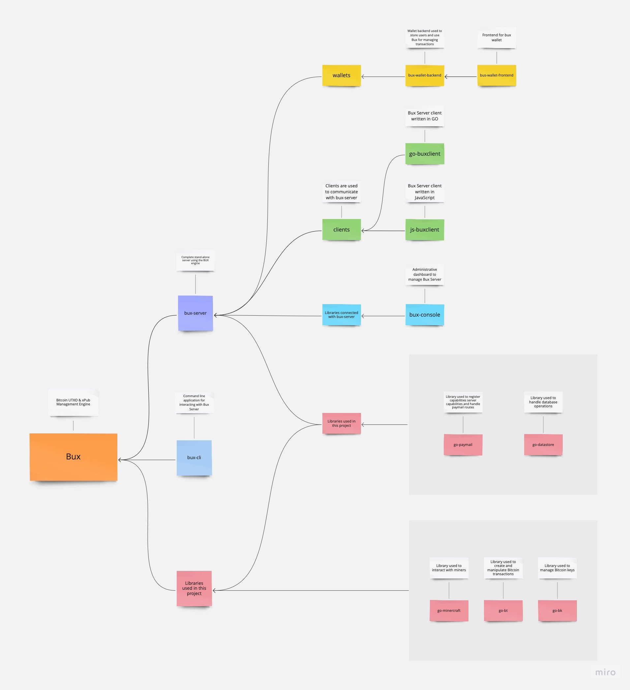

# Bux Org

This is the main documentation for the BuxOrg ecosystem. Here you can find all the information about it and how to use it.

### Table of Contents
1. [BUX](bux/README.md)
2. [Bux CLI](bux-cli/README.md)
3. [Bux Console](bux-console/README.md)
4. [Bux Server](bux-server/README.md)
5. [JS BuxClient](js-buxclient/README.md)
6. [GO BuxClient](go-buxclient/README.md)
7. [GO Paymail](go-paymail/README.md)
8. [Example Deployment](deployment/microk8s.md)

## BuxOrg ecosystem

This diagram shows how BuxOrg ecosystem is built. It is a set of tools which can be used to create a wallet, 
send and receive transactions, create and manage paymails and more. 
It is built to be used as a standalone app or as a module in bigger system.
