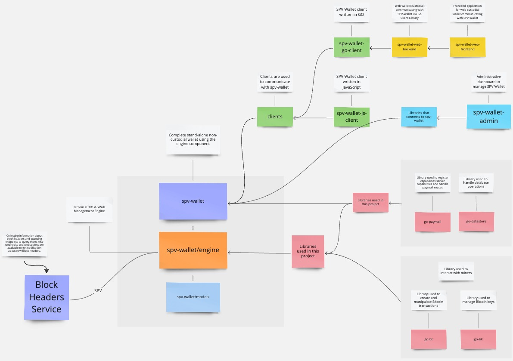

# SPV Wallet Toolbox

This is the main documentation for the SPV Wallet ecosystem. Here you can find all the information about it and how to use it.

## Table of Contents

1. [SPV Wallet Engine](spv-wallet/engine/README.md)
2. [SPV Wallet](spv-wallet/README.md)
3. [SPV Wallet Admin](spv-wallet-admin/README.md)
4. [SPV Wallet JS Client](spv-wallet-js-client/README.md)
5. [SPV Wallet GO Client](spv-wallet-go-client/README.md)
6. [GO Paymail](go-paymail/README.md)
7. [Example Deployment](deployment/microk8s.md)
8. [SPV Wallet Admin Keygen](spv-wallet-admin-keygen/README.md)

## SPV Wallet ecosystem

This diagram shows how SPV Wallet Toolbox is built. It is a set of tools which can be used to create a wallet,
send and receive transactions, create and manage paymails and more.
It is built to be used as a standalone app or as a module in bigger system.
