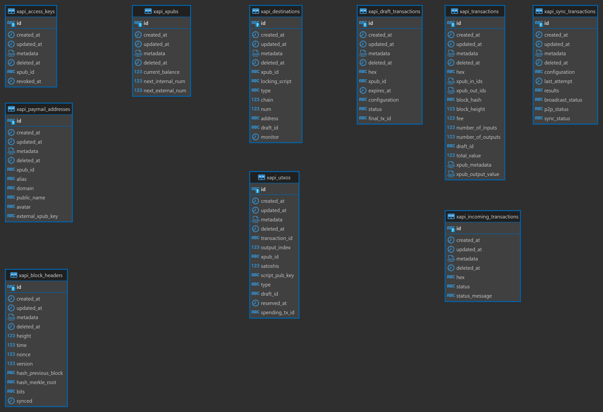
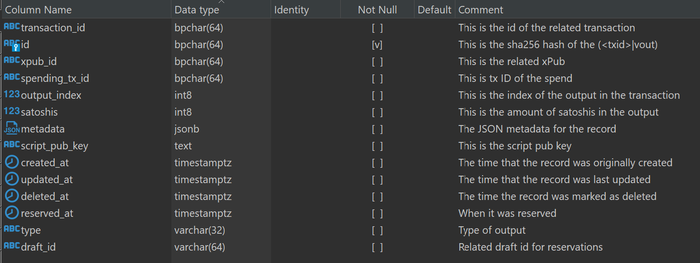

# SPV Wallet Engine database schema

SPV Wallet Engine transaction engine database overview:

>**Note**: The lack of relations in database does not mean there is no logical relationships between models.

## Tables

>**Note**: Prefix 'xapi' will be omitted in further descriptions.

### xpubs

Represents an HD-Key or extended public key (xPub for short). Model has no external references.

### access_keys

AccessKey is a private key with a corresponding public key. Model is linked to **xpubs** by _xpub_id_ field.

### paymail_addresses
  
Represents paymail data like _public name, avatar etc._. Model is linked to **xpubs** by _xpub_id_ field.

### block_headers

Represents the BitCoin block header. Model may refer to another **block_header** record through _hash_previous_block_ field.

### transactions

Represents the BitCoin transaction. In the table we store all transactions in the system: outgoing and incomig ones. In other words, **transaction** record is created based on record from **draft_transactions** (for outgoing) and based on **incoming_transactions** (for incoming). Outgoing transaction will refer to **draft_transactions** by _draft_id_ field, incoming will refer to **incoming_transactions** by by _id_ field (1:1).

>**Note**: Transactions inside the same SPV Walllet Engine system (between two paymails in same system) are recorded as **outgoing** only!

### draft_transactions

Represents the draft _outgoing_ BitCoin transaction prior to the final transaction. Model is linked  to **xpubs** by _xpub_id_ field and **transactions** by _final_tx_id_.

* ### sync_transactions
Represents the chain-state sync configuration and results for a given transaction. Sync record is added for EVERY transaction in system (outgoing and incoming). Model is linked to **transactions** by _id_ field (1:1).

>**Note**: **sync_transactions** does not represents transaction per se, but its synchronization state.

Possible values for status fields (_p2p_status, sync_status, broadcast_status_ ):

* _pending_ - is when the sync is pending (blocked by other constraints)
* _ready_ - is when the sync is ready (waiting for workers)
* _processing_ - is when the sync is processing (worker is running task)
* _canceled_ - is when the sync is canceled
* _skipped_ - is when the sync is skipped
* _error_ - is when the sync has an error
* _complete_ - is when the sync is complete

### incoming_transactions

Represents the incoming (external) transaction (for pre-processing). Model is related to **transactions** by _id_ field (1:1).

>**NOTE**: Internal incoming transactions (from SPV Wallet to SPV Wallet) are not recorded in **incoming_transactions**

### utxos

Represents a BitCoin unspent transaction. Model is related to **transactions** by _transaction_id_ field.

