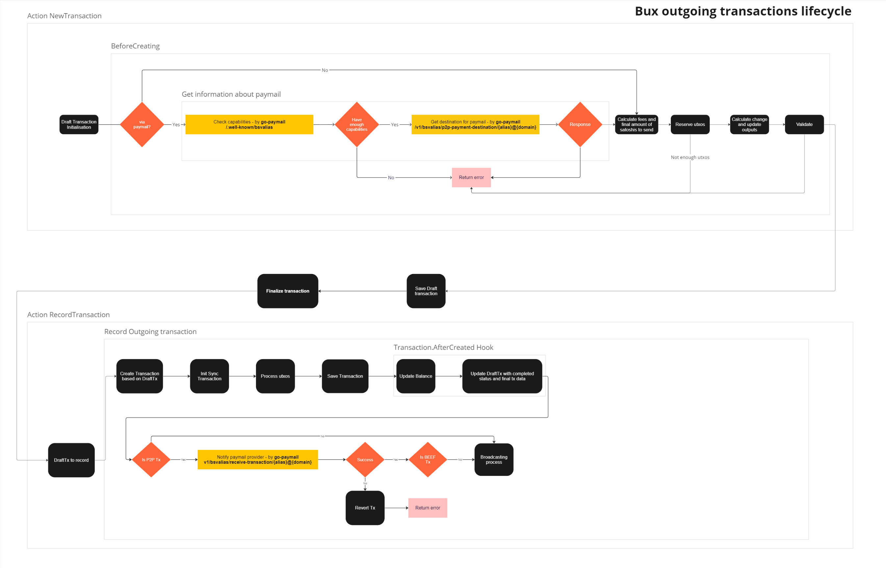

# Transactions

In general, we can treat transactions as outgoing (sent by a Bux user) or incoming (received by a Bux user). Below, we describe outgoing transactions and the sending transaction flow. To read about incoming transactions, go [here](incoming_transaction.md).

## Flow


Process of sending new transaction in Bux consists of 3 stages:
1. Creation of a Draft Transaction
2. Finalize Ttransaction
3. Record Transaction

### Creation of a Draft Transaction

Initialize a new draft transaction acording to providen transaction config, where, in addition to mandatory "to"(recepient) and "satoshis", you can specify your own fee value, transaction expiration time, utxos which will be used and change destination strategy.
Next, processing of outputs are started. It inspects the outputs to determine how they should be processed. In case if paymail was used as a transaction destination additional endpoints will be called:
* Before calling the next endpoints {receiver_paymail_host} should be retreived. And it will be retrieved from SRV record for a given paymail. It's done by `go-paymail` library.
1. `{receiver_paymail_host}/.well-known/bsvalias`
   Retrieves capabilities for a Paymail provider.
   Example response:
    ```json
   {
    "bsvalias": "1.0",
    "capabilities": {
        "2a40af698840": "https://sample.bux.server.net/v1/bsvalias/p2p-payment-destination/{alias}@{domain.tld}",
        "5f1323cddf31": "https://sample.bux.server.net/v1/bsvalias/receive-transaction/{alias}@{domain.tld}",
        "6745385c3fc0": false,
        "a9f510c16bde": "https://sample.bux.server.net/v1/bsvalias/verify-pubkey/{alias}@{domain.tld}/{pubkey}",
        "f12f968c92d6": "https://sample.bux.server.net/v1/bsvalias/public-profile/{alias}@{domain.tld}",
        "paymentDestination": "https://sample.bux.server.net/v1/bsvalias/address/{alias}@{domain.tld}",
        "pki": "https://sample.bux.server.net/v1/bsvalias/id/{alias}@{domain.tld}"
    }
    }
   ```
2. `{receiver_paymail_host}/v1/bsvalias/p2p-payment-destination/{alias}@{domain}`
   Retrieves the list of outputs for the P2P transactions to use. Will be called only in case if paymail's capabilities will contain P2P urls. In the moment every paymail should contain P2P urls, as second non-P2P paymail processing method is depricated.
   ⚠️ Every call on this endpoint creates new destination (with new address) which is saved in db.\
   Example response:
    ```json
   {
    "outputs": [
        {
            "address": "1NSTSMD448yok4y128CENUeGX5mTbFrK1H",
            "satoshis": 1000,
            "script": "76a914eb2b1be9b79baff275f44f556a0cade66582fc7f88ac"
        }
    ],
    "reference": "90030d54ee6e6d35b4cb7c62fd25dad5"
    }
   ```
   * Every endpoint connected to paymail is defined in `go-paymail` library.
Next, fees are calcualted, the utxos are reserved, necessery output is added and the result is validated.
And if the transaction is valid it's saved in db and waiting for the next step. 

### Finalize transaction

Finilize draft transaction stage signs all transaction's inputs by give xPriv key and returns its signed hex

### Record Transaction

Save final transaction in datastore and send it to network/receiver.

#### Record transaction. Detailed flow

1. Create the final transaction based on the draft.
2. Create and initialize SyncTx (used for handling synchronization with the network).
3. Process UTXOs.
4. Save the transaction.
   1. The AfterCreated Hook will update the balance and the draft transaction with final transaction data.
5. (Optional) Notify P2P receiver if needed.
6. Broadcast the transaction to the network (except if the transaction was sent via Paymail in BEEF format).


### Broadcasting
Broadcasting is the process of sending a transaction to the network. It can be triggered as part of the transaction-sending flow or within the `BroadcastTransaction` task based on SyncTx configuration (activated in case of errors during broadcasting in the flow).
Transactions are broadcasted to different providers, with several utilizing `mAPI` and/or `ARC`. Bux simultaneously broadcasts transactions to all providers.

The client is promptly notified of the fastest provider that successfully responds to the broadcast at the exact moment, eliminating the need to wait for responses from other providers.
