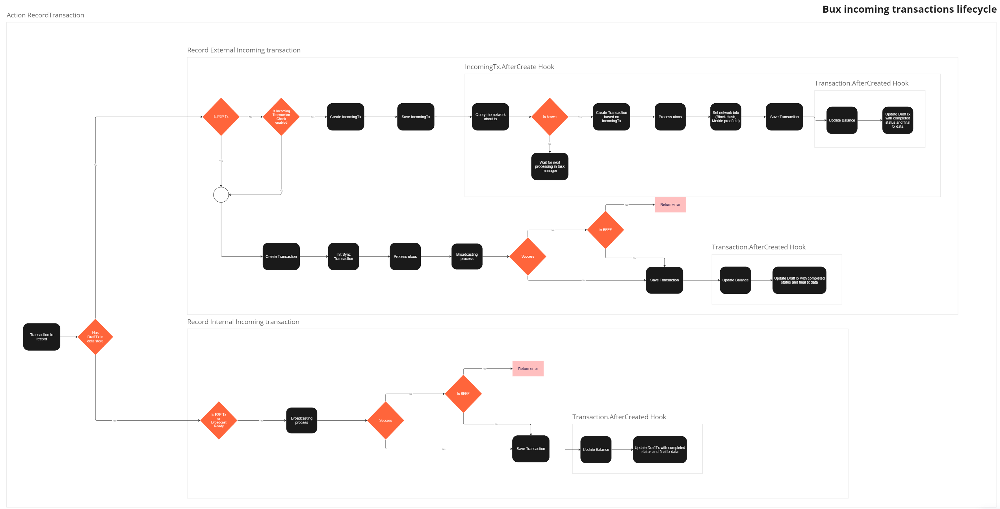
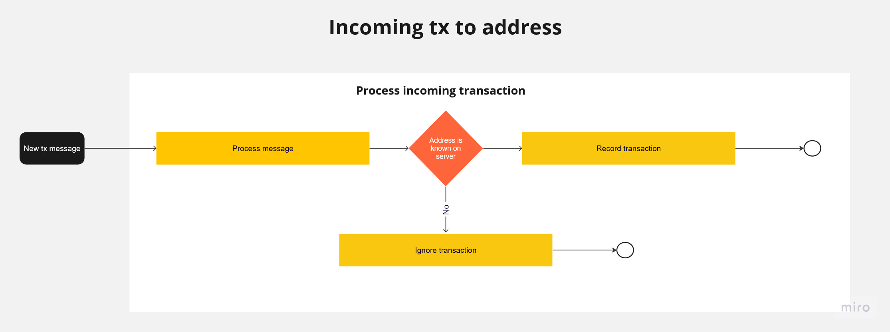

# Transactions

In general, we can treat transactions as outgoing (sent by a Bux user) or incoming (received by a Bux user). Below, we describe incoming transactions and the receiving transaction flow. To read about outgoing transactions, go [here](README.md).

> NOTICE: The following description and diagrams pertain only to the Bux processing part. When discussing Paymail transactions in BEEF format, we assume the transaction has passed SPV and undergone all necessary processing.

The Bux Server is capable of working with both traditional address transactions and transactions using the Paymail protocol

# Incoming paymail transaction

Paymail transaction are received via endpoints: 
 * `/v1/bsvalias/receive-transaction/{alias}@{domain}`
 * `/v1/bsvalias/beef/{alias}@{domain}`

Process receiving new transaction in Bux consists of 2 stages:
1. (Optional) SPV if Transaction was sent in BEEF
2. Record Transaction

### SPV
To read more about SPV go [here](https://bsv.brc.dev/transactions/0067).

### Record Transaction

Broadcast the transaction to the network and save it in the datastore if it is an external transaction.

#### Record transaction. Detailed flow

When recording incoming transactions, we need to categorize them into two types: internal transactions (sent by a user from the same server) and external transactions (sent from the outer world).

Steps for internal transaction:
1. Broadcast the transaction to the network.
    1. If the transaction is in BEEF and broadcasting fails, reject the transaction and return an error.
2. Save the transaction.

Steps for external transaction:
1. If Incoming Transaction Check is enabled (NOTICE: it won't work for BEEF transactions):
   1. Create IncomingTx.
   2. Save IncomingTx.
      1. Query the network about the transaction.
      2. If the transaction is known by the network, create the final transaction and save it to the datastore.
      3. If not, leave it for the task manager to check the transaction.
2. Broadcast the transaction to the network.
    1. If the transaction is in BEEF and broadcasting fails, reject the transaction and return an error.
3. Save the transaction.

> Broadcasting is described [here](README.md/#broadcasting)

# Incoming address transaction

This diagram show how incoming address transaction is processed.

> [Click here to find whole board](https://miro.com/app/board/uXjVM4AhDEA=/)

To work with Address incoming transactions Bux Server must have Monitor service configured (read how to do it [here](./configuration.md/#configuration-file-structure)).
The Monitor service connects to a messaging server and listens for two types of messages: `mempool:transactions` and `block:headers`. 

>TODO: investigate what messaging server we use and how it works

The `mempool:transactions` indicates that a new transaction has occurred in the mempool. The Bux server checks the transaction against the registered addresses in its own database, if the recipient of the transaction is a known address Bux-Server will record transaction (whitout broadcasting).
